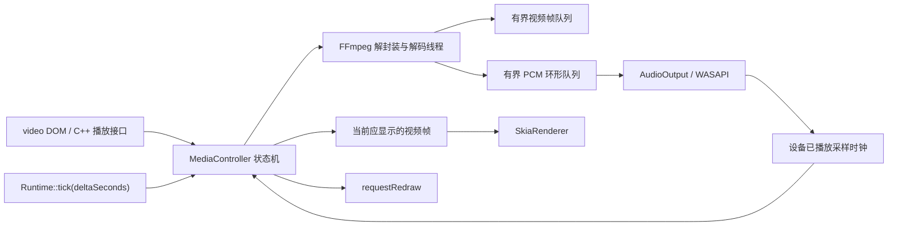

# SkiaUI 视频播放实施计划

## 当前实施状态（2026-07-21）

首期软件播放链路已经落地：显式 `preload="auto"` / `prepareVideoById()` 预解码、按需播放、
PTS 选帧、音频设备主时钟、WASAPI shared mode、seek、暂停、静音、有界循环头缓存、
VP8/VP9 named libvpx 选择、透明 BGRA 预乘和 Skia 绘制均已接入。仓库内的 10 FPS VP9
Alpha fixture 会验证 `libvpx-vp9`、半透明像素、预解码高水位和多次循环边界；另有 fake
音频设备测试证明引擎 tick 次数不会推进有音轨媒体时钟。

本次没有实现硬件解码。第 9 节的 GPU surface 直达研究仍是独立后续工作；硬解后读回 CPU
再上传 GPU 仍只作为未来基准对照。音量控制、媒体 DOM 事件和完整性能指标也尚未公开，
不应视为首期接口的一部分。

## 1. 目标与范围

本计划为 SkiaUI 增加基于 FFmpeg 的视频和音频播放能力，首期必须同时满足：

- 只有调用方提前声明预加载时，才异步打开媒体并预解码少量帧。
- 预解码缓冲达到高水位后停止继续解码；开始播放并消耗缓冲后再按需补充。
- 仅当调用方显式声明 `preload="auto"` 或提前调用 `prepareVideoById()` 时，才保证在后续
  播放请求到来前已经准备好首帧和对应音频，从而避免点击播放后再等待打开媒体产生黑屏。
- 未声明预加载时，`playVideoById()` 才开始打开和预缓冲媒体；这种按需播放不承诺从播放
  请求到首帧可见之间没有短暂空画面。
- 本地文件和 FFmpeg 支持的 URL 使用同一套 `src` 打开流程，不实现额外网络层。
- 支持普通视频和带 Alpha 的 VP8/VP9 WebM；WebM 的 VP8/VP9 流强制使用对应 libvpx
  decoder，不能静默使用会丢失透明通道的 FFmpeg 内置 decoder。
- 首个功能阶段只实现和验证软件解码，先把预加载、音视频同步、循环、透明 WebM 和变动
  引擎帧率下的呈现做正确。
- 硬件解码作为后续独立技术探索：重点验证解码后的 GPU surface 能否不经 CPU readback
  直接交给 Skia/图形后端；验证成功后才产品化并加入自动软件回退。
- 视频和音频从第一期就使用同一媒体时间线，不能把音频作为后续附加能力。
- 以帧 PTS 和音频播放位置调度，不把“每次引擎 tick”理解成“消费一张视频帧”。
- 媒体自身可以是 10 FPS、25 FPS、30 FPS、120 FPS 或可变帧率；引擎 tick / 渲染频率
  也可以在运行中从 30 FPS 波动到 35 FPS，二者必须完全解耦。
- 引擎呈现频率高于媒体帧率时等待下一帧 PTS 并重复显示当前帧；呈现频率低于媒体帧率时
  丢弃已经过期的中间帧，直接显示当前媒体时间对应的最新帧。两种情况下媒体都保持 1 倍速。
- 播放时间由 `Runtime::tick(deltaSeconds)` 驱动和提交，FFmpeg 解码、像素转换、
  音频重采样均不进入 tick 或渲染热路径。
- 循环播放时持续保有下一轮开头的视频帧和音频数据，不在循环边界等待 seek 和重新解码。

首期不实现浏览器完整媒体标准、DRM、字幕、画中画或内置媒体控制条。播放控制通过
HTML 属性和 C++ API 提供，业务 UI 可以使用普通 SkiaUI 节点自行组合控制条。

## 2. “预解码”的行为定义

预解码不是把整个媒体文件永久解码到内存。它是一个显式启动、容量受限的预缓冲过程：

1. 未声明预加载且没有调用播放接口时，不打开媒体、不创建解码器、不占用帧缓冲。
2. 声明 `preload="auto"` 后，后台任务打开媒体、创建音视频解码器并开始解码。
3. 至少缓存配置数量的视频帧，并缓存覆盖同一时间范围的音频 PCM。
4. 显式预加载时，首帧解码完成后可以立即作为静止画面显示；音视频达到启动水位后进入
   Ready，后续播放请求可以直接启动，不再承担打开和首轮解码延迟。
5. 高水位满足后，解码线程在条件变量上等待，不继续读取和解码。
6. 播放消费到低水位后唤醒解码线程，补充到高水位后再次等待。
7. 暂停时保留现有缓冲，不因为 tick 继续到来而无限解码。
8. seek、换源和关闭会取消旧代次的预解码，清理音视频缓冲，然后按新位置重新预缓冲。

未声明预加载时，调用 `playVideoById()` 会从 Idle 进入 Opening 和 Prebuffering。为了保证
音视频同步，媒体时钟仍然要等启动水位满足后才推进；但在首帧产生之前，元素可能显示透明
区域、背景或后续定义的 poster。这个路径不属于“播放前已预解码”，也不提供零黑屏承诺。

推荐的首期 HTML 形态：

```html
<video
    id="intro-video"
    src="media/intro.webm"
    preload="auto"
    data-predecode-frames="4"
    autoplay
    loop>
</video>
```

属性语义：

| 属性 | 首期行为 |
| --- | --- |
| `src` | 本地相对路径、绝对路径或 FFmpeg 可打开的 URL |
| `preload="none"` 或省略 | 不提前打开；调用 `playVideoById()` 时才打开和预缓冲 |
| `preload="metadata"` | 只打开容器并读取流信息，不启动帧解码 |
| `preload="auto"` | 立即异步打开并填充音视频预解码缓冲 |
| `data-predecode-frames` | 当前元素的视频高水位帧数；省略时使用运行时默认值 |
| `autoplay` | 预缓冲完成后开始播放；没有该属性时停在 Ready 和首帧状态 |
| `loop` | 在 EOF 后接续下一轮时间线 |
| `muted` | 保留音频解码和时间线，但不向设备输出声音 |
| `width` / `height` | 与 `img` 一致，作为低优先级展示尺寸参与布局 |

`display:none` 不取消显式的 `preload="auto"`。提前声明预加载的目的就是让隐藏状态下也能
准备好首帧；未声明预加载的隐藏视频不会因为渲染遍历而自动启动。

## 3. 参考实现中需要继承和修正的行为

用户提供的 `FFmpegPlayer.h/.cpp` 和 `SoundWaveFFmpeg.h/.cpp` 中有以下可复用设计：

- `AsyncOpenImp()` 在后台完成打开文件、查找流和创建解码器。
- `CacheFrameCount` 是少量预解码帧数量，不是整段媒体缓存预算。
- `CheckReadNextFrame()` 在等待渲染帧达到容量后停止继续读取。
- `ReadFrame()` 串行读取 packet，再分别送入视频和音频解码器。
- 创建视频 codec context 前，VP8 通过名字选择 `libvpx`，VP9 通过名字选择
  `libvpx-vp9`，这是透明 WebM 能正确取得 Alpha 的关键路径。
- 视频帧携带 `timebase`、循环代次和 seek 代次，渲染端按播放时间选帧。
- EOF 后 seek、flush 解码器，并通过解码循环计数和渲染循环计数区分不同轮次。
- `USoundWaveFFmpeg` 使用独立 PCM 队列，由音频回调消费，不在渲染线程播放音频。

SkiaUI 实现不能直接照搬以下部分：

- UE 的 `UObject`、`TArray`、`FRWLock`、`UE::Tasks`、`USoundWave` 和 RHI 纹理接口。
- 参考实现按平均帧率和半帧区间选帧，不能完整覆盖可变帧率素材。
- 参考实现的音频队列满时可能丢弃数据，也没有向播放器提供真实设备播放位置。
- 参考实现枚举到第一个硬件设备就尝试使用，没有根据解码器支持能力筛选，也没有完整的
  运行时软解回退流程。
- 参考实现直接在 EOF 后 seek；如果 seek 或首帧重解码较慢，循环边界仍可能耗尽队列。
- 透明视频不能只要求输出 RGBA，还必须验证 WebM Alpha 数据确实被解码并正确预乘。

## 4. 模块边界

保持之前确定的模块方案：

- `Skui`：媒体接口、DOM 状态、播放状态机、tick 调度、Skia 绘制接入。
- `SkuiFfmpeg`：首期负责 FFmpeg 解封装、软件解码、颜色转换和音频重采样；硬件解码在
  独立探索完成后通过后端扩展接入。
- `SkuiWin32Audio`：独立的 WASAPI 音频输出实现；只由需要带声音媒体播放的目标链接。
- `SkuiWin32Dx12`：Win32/DX12 窗口宿主，不直接链接 FFmpeg 或自动启用视频。
- 自定义宿主：可以实现同一个 `AudioOutput` 接口，把 PCM 交给引擎或其他平台音频系统。

FFmpeg 仍是可选模块依赖，纯图片/文本 SkiaUI 使用者不被强制链接 FFmpeg。CMake 增加
`SKIAUI_ENABLE_FFMPEG_VIDEO`，vcpkg 依赖至少包含：

```json
{
  "name": "ffmpeg",
  "default-features": false,
  "features": [
    "avcodec",
    "avformat",
    "avutil",
    "swscale",
    "swresample",
    "vpx"
  ]
}
```

不使用 `libavfilter` 完成普通颜色转换；视频走 `libswscale`，音频走 `libswresample`。

## 5. 运行结构



### 5.1 每个播放器的所有权

每个活动媒体元素拥有一个 `MediaPlayer`：

- 一个串行 FFmpeg worker，独占对应的 `AVFormatContext`、音视频 `AVCodecContext`、
  `SwsContext` 和 `SwrContext`。
- 一个有界视频帧队列。
- 一个适合单生产者、单消费者的 PCM 环形队列。
- 一个只保存小段开头数据的循环头缓存。
- 一个状态机和播放时钟。
- 一个取消标记、条件变量和代次编号。

FFmpeg context 不跨线程调用。worker 负责 demux、decode、格式转换和重采样；UI/tick 线程只
读取队列元数据和当前视频帧；音频设备回调只消费已经转换好的 PCM，不能加可能阻塞的锁、
不能调用 FFmpeg、不能触发 DOM 回调。

### 5.2 状态机

```text
Idle
  -> Opening
  -> Prebuffering
  -> Ready
  -> Playing <-> Paused
  -> Seeking -> Prebuffering
  -> Ended
  -> Failed
  -> Closed
```

- `preload="metadata"` 停在已经获得媒体信息但没有帧缓冲的 Ready 子状态。
- `preload="auto"` 进入 Prebuffering，音视频达到启动水位后进入 Ready。
- 播放请求可以在任意非失败状态发出；如果还未 Ready，记录请求并在预缓冲完成后启动。
- 缓冲意外耗尽时进入 Rebuffering：保留最后一张视频画面、暂停音频设备和媒体时钟，重新
  达到启动水位后一起恢复，避免视频继续走而音频静音。
- `Closed` 必须中断 FFmpeg I/O、唤醒 worker 并完成 join，所有对象保持可析构。

## 6. 音视频预缓冲

### 6.1 水位定义

运行时提供统一默认值，元素可以只覆盖视频帧数：

```cpp
struct MediaBufferOptions {
    size_t videoHighWaterFrames = 4;
    size_t videoLowWaterFrames = 2;
    float minimumAudioLeadSeconds = 0.15f;
    float maximumAudioLeadSeconds = 0.50f;
};
```

上述数值只是初始建议，最终通过测试素材和帧时序数据确定，不作为未经验证的固定常量提交。

预缓冲完成必须同时满足：

- 视频队列至少达到 `videoHighWaterFrames`，或已经到 EOF。
- 音频已经覆盖到最后一张缓存视频帧的结束 PTS，并满足最小设备前导量；无音轨时忽略。
- 已经获得一张可显示的首帧。

只按视频帧数停止可能导致 10 FPS 素材缓存时间过长、120 FPS 素材缓存时间太短。因此帧数
是调用方可理解的主要配置，同时内部还要检查队列覆盖的时间范围。低水位判断同样综合帧数
和媒体时间，避免不同帧率使用同一帧数时产生完全不同的抗抖动能力。

### 6.2 worker 等待与唤醒

- 预加载时填充到高水位，然后等待。
- Playing 状态下降到低水位时由消费方通知 worker。
- worker 一次补充到高水位，不进行每帧一次的任务创建和销毁。
- Paused 状态不因为低水位而补充已经足够的数据；seek 和换源除外。
- 音视频队列容量是硬上限，不能通过无限分配规避消费者过慢。
- 不在持锁期间执行 `av_read_frame()`、解码、转换、音频输出或业务回调。

## 7. 时间线与音视频同步

### 7.1 时间戳标准化

- 视频使用 `AVFrame::best_effort_timestamp`，回退时才使用 `pts`。
- 音频使用 frame PTS 和实际采样数量计算结束时间。
- 所有时间戳通过各自 `AVStream::time_base` 转成统一的秒或整数微秒时间线。
- 减去 stream `start_time`，让媒体播放起点标准化为零。
- 保留每帧真实 duration；缺失时才根据下一帧 PTS 或流信息估算。
- 处理音频 codec delay、skip samples、discard padding 和重采样器延迟，避免循环头尾多出静音。

### 7.2 主时钟

有可播放音轨时，音频设备时钟是主时钟：

```text
mediaTime = firstQueuedAudioPts
          + devicePlayedSampleFrames / outputSampleRate
          - knownOutputLatency
```

`AudioOutput` 必须报告已经真正提交/播放的采样帧数或等价的单调播放位置。不能用“写入 PCM
队列的数量”冒充播放位置，因为设备缓冲和系统延迟会让写入位置领先于用户听到的位置。

无音轨、静音且选择停止音频设备，或宿主没有音频输出时，媒体时钟由
`Runtime::tick(deltaSeconds)` 累积。暂停时两种时钟都停止推进。

### 7.3 变动引擎帧率下的按时钟呈现

每次 `Runtime::tick()`：

1. 查询音频主时钟，或推进无音频媒体时钟。
2. 查看队列中下一张视频帧的 PTS。只要 `next.pts <= mediaTime`，就把它推进为当前帧；
   如果一次 tick 跨过多张帧，只保留其中 PTS 最大且不晚于 `mediaTime` 的一张，其余记为
   late/drop。
3. 如果 `next.pts > mediaTime`，不消费下一帧，继续显示当前帧。这是引擎频率高于媒体帧率时
   的正常等待，不是卡顿。
4. 当前帧持续显示到下一张帧的 PTS 到达；不能因为引擎多 tick 了一次就提前消费下一帧。
5. 当前显示帧发生变化后标记 runtime dirty；Playing 状态仍需后续时间推进时让 `tick()`
   返回 `true`。

因此播放速度只取决于单调媒体时钟，不取决于 tick 次数：

- 25 FPS 视频、50 FPS 引擎：一张源视频帧通常跨两个引擎呈现周期，第二个周期继续绘制同一帧。
- 25 FPS 视频、10 FPS 引擎：每个引擎周期推进到当前时刻应显示的最新源帧，中间未能呈现的
  源帧被丢弃，但视频和音频仍在正确的 1 倍速时间位置。
- 引擎在 30/35 FPS 间波动：每次使用真实 `deltaSeconds` 或音频设备位置重新采样媒体时间，
  不累积“已经消费了多少帧”来推算播放进度。
- 120 FPS 视频、60 FPS 引擎：媒体时长正确，但物理上无法显示全部源帧；若要求每张源帧都
  可见，宿主 tick 和呈现能力也必须达到相应频率。

这里“完整输出”指媒体按正确时间线从头播放到尾、音视频不因引擎频率变化而加速或减速；
当引擎呈现频率低于源视频帧率时，丢弃中间视觉帧是维持实时播放的必要行为。

### 7.4 音频输出格式

- FFmpeg 使用 `libswresample` 转换成音频设备接受的交错 PCM。
- 内部首选 `float32`，声道布局和采样率由 `AudioOutput` 协商后固定。
- Win32 内置宿主使用 WASAPI shared mode；自定义引擎通过 `AudioOutput` 接口接收 PCM。
- 音频回调发生欠载时记录 underrun，不自行推进虚假的播放时钟。
- 音量和静音在音频输出前处理，不改变解码时间线。

## 8. 无卡顿循环

仅在 EOF 后现场 seek 并不能保证循环无卡顿。首期采用“正常有界缓冲 + 小型循环头缓存”：

1. 第一次预解码时额外保留最前面的若干视频帧，以及覆盖同一时间范围的音频 PCM。
2. 正常播放仍使用有界队列，循环头缓存不随第一轮消费而释放。
3. worker 读到 EOF 且元素声明 `loop` 时，立即把循环头缓存以新的时间线偏移加入队列。
4. 同时执行 `av_seek_frame()` / `avformat_seek_file()`，flush 音视频解码器和重采样器。
5. 从起点重新解码时跳过已经由循环头缓存补入的时间段，防止重复帧和重复音频。
6. 每轮增加 `loopGeneration`，对外媒体时间可以取模显示，对内队列时间戳始终单调递增。
7. 视频 tick 和音频设备因此可以直接跨过循环边界，不需要清空当前显示帧或暂停设备。

若容器报告的 duration 不可靠，以实际解码到的音视频结束时间确定循环偏移。对无法 seek 的
输入，FFmpeg 打开和播放仍按普通 URL 处理，但 `loop` 只能在输入本身支持重定位时成立。

## 9. 硬件解码独立探索计划

### 9.1 首期决策

首个可交付版本只使用软件解码，不立即实现硬件解码，也不提前公开看似可用但尚未验证的
`Auto` / `Hardware` 模式。这样可以先建立行为正确、可测试的基线：

- 显式少量预解码。
- 音频主时钟和变动引擎帧率下的视频呈现。
- 音视频无卡顿循环。
- 强制 libvpx 软件解码的 VP8/VP9 透明 WebM。
- seek、换源、取消和线程生命周期。

软件解码基线也是以后评估硬解收益、画质、延迟和资源占用时必须保留的对照组。

### 9.2 两种硬件解码路径

硬件解码需要分别研究两条完全不同的数据路径，不能把“成功创建硬件 decoder”直接视为
功能完成。

#### 路径 A：GPU surface 直接渲染

目标数据流：

```text
FFmpeg 硬件解码器
  -> GPU video surface
  -> GPU 颜色转换 / Skia 可消费纹理
  -> SkImage
  -> Skia 绘制
```

该路径要求解码结果始终留在 GPU：

- FFmpeg 硬件设备和 Skia 图形后端使用同一 GPU，并能共享或导入底层资源。
- 优先研究与当前 DX12 后端一致的 D3D12VA 路径；如果只能使用 D3D11VA，需要单独验证
  D3D11/D3D12 共享资源、同步和额外 GPU copy 的代价。
- NV12、P010 等硬件表面要通过 GPU 完成颜色空间转换，不能为了得到 BGRA 而读回 CPU。
- 必须处理资源状态、queue ownership、fence、surface pool 和 `sk_sp<SkImage>` 生命周期。
- 预解码帧队列持有的是硬件 surface 引用，不能让 decoder 提前复用仍在显示的 surface。
- 要验证 Skia Ganesh D3D 后端能否稳定包装或导入这些纹理，并兼容 CPU fallback renderer。
- 透明 WebM 不属于首轮硬件探索目标，正式路径继续强制使用 libvpx 软件 decoder。只有未来
  单独证明硬件 surface 能完整携带并合成 Alpha 后，才可以重新评估这一约束。

只有这条路径能够成立并表现出明确收益时，硬件解码才适合进入正式实现。

#### 路径 B：硬解后读回 CPU 再上传 GPU

数据流：

```text
FFmpeg 硬件解码器
  -> GPU video surface
  -> av_hwframe_transfer_data() 读回 CPU
  -> swscale 转 BGRA
  -> CPU raster SkImage
  -> 再上传 GPU
```

该路径同时承担 GPU 到 CPU 同步、CPU 颜色转换和 CPU 到 GPU 上传，通常会抵消硬件解码
节省的时间，并增加延迟和显存/内存带宽压力。它不作为正式产品目标，只在探索阶段作为
对照实验，帮助量化直接渲染路径的价值。除非基准数据证明它在目标素材和设备上仍有稳定、
显著收益，否则不提交这条实现到正式播放链路。

### 9.3 探索任务和退出条件

硬件探索在软件版本稳定后单独进行，不直接修改正式媒体状态机。先建立隔离原型，完成：

1. 列出目标 codec、像素格式、FFmpeg hardware device、Skia backend 和 Windows 版本矩阵。
2. 确认当前 Skia DX12 context 使用的设备能否提供给 FFmpeg，或能否安全导入解码资源。
3. 分别跑通“直接 GPU surface”与“CPU readback”最小原型。
4. 对比纯软件、GPU 直达、硬解读回三种路径的 decode time、GPU time、CPU time、延迟、
   显存、系统内存和帧抖动。
5. 验证少量预解码时硬件 surface pool 不会被耗尽或提前复用。
6. 验证 seek、循环、resize、device lost 和播放器销毁时的 GPU 同步与资源回收。
7. 验证普通非透明视频；透明 WebM 继续走强制 libvpx 路径，不能为了硬解绕回会丢 Alpha
   的内置 decoder。

进入正式实现的最低条件：

- 播放热路径没有 GPU 到 CPU readback。
- 不需要在 CPU 上转换 RGBA/BGRA 后再次上传。
- 相比软件解码，在目标设备和代表性素材上有可重复的端到端收益。
- 不破坏现有平台无关 `Skui` 核心；后端专用代码有独立 target 和接口边界。
- 生命周期、同步、循环和软件 fallback 的实现方案已经通过原型验证。

任一关键条件不成立，就保留软件解码作为正式实现，不为了标注“支持硬解”引入一条实际
收益很低且维护成本高的路径。

### 9.4 通过探索后的产品化方向

只有 GPU 直接渲染路径通过退出条件后，才增加解码偏好、硬件 backend 和自动回退：

- `Auto` 先检查当前 renderer/backend 是否提供兼容的 GPU video frame importer。
- 素材、codec 或设备不满足直达条件时，从打开阶段直接选择软件解码；透明 WebM 无条件
  选择对应的 libvpx named decoder。
- 硬件设备创建、纹理导入、同步或运行时设备状态失败时，关闭硬件播放代次，保留最后画面，
  重新建立软件解码并预缓冲后恢复。
- 软件回退必须保持原媒体时间、音频状态和循环代次，不能从零重新播放。

自动回退属于硬件产品化的一部分，不进入首个软件解码交付阶段。

## 10. 透明 WebM

WebM Alpha 的颜色数据和 Alpha 数据由容器分别承载。FFmpeg 内置 VP8/VP9 decoder 不能作为
透明 WebM 的解码路径，必须按参考实现显式选择 libvpx：

1. 确认输入是 WebM/Matroska WebM，并取得视频流 `codec_id`。
2. `AV_CODEC_ID_VP8` 强制调用 `avcodec_find_decoder_by_name("libvpx")`。
3. `AV_CODEC_ID_VP9` 强制调用 `avcodec_find_decoder_by_name("libvpx-vp9")`。
4. named decoder 选择必须发生在 `avcodec_alloc_context3()` 之前，codec context 只能使用该
   decoder 创建。
5. 对 WebM VP8/VP9 不先调用通用 `avcodec_find_decoder(codec_id)` 再把它作为可接受回退。
6. 找不到对应 libvpx decoder 时打开失败，返回明确的 `RequiredDecoderUnavailable` 类错误；
   不能继续播放一个 Alpha 已经丢失但表面上“打开成功”的视频。

FFmpeg 构建必须启用 vpx feature。即使已经强制选择 libvpx，仍要检查容器 Alpha 标记、
packet side data 和实际解码帧像素格式；对带 Alpha 素材验证输出为 YUVA 或其他确实包含
Alpha 的格式。如果素材声明 Alpha 但解码结果没有 Alpha，按解码失败处理，不能当作普通
不透明视频继续播放。

后续像素处理要求：

- 使用 `libswscale` 转换成明确的 `AV_PIX_FMT_BGRA`。
- 在 worker 中把 straight Alpha 转成 premultiplied Alpha，再构造
  `kBGRA_8888_SkColorType + kPremul_SkAlphaType` 的 raster `SkImage`。
- Skia 默认 `SrcOver` 混合，透明视频应能与节点背景、父节点和后续 UI 正确合成。
- 透明 WebM 固定使用对应的 libvpx 软件 decoder，不参与首轮硬件解码产品化，也不采用
  硬解后读回 CPU 的折中路径。

测试必须覆盖完全透明、完全不透明和半透明边缘，防止通道顺序错误、Alpha 丢失、黑边和
错误预乘。

## 11. DOM、Runtime 和公开接口

### 11.1 DOM 接入

- parser 保留 `video` 节点及所有媒体属性。
- `video` 与 `img/svg` 一样应用 HTML `width` / `height` 展示属性。
- 媒体 metadata 到达且 CSS 尺寸为 auto 时，使用视频固有宽高触发一次布局。
- `src`、`preload`、`autoplay`、`loop`、`muted` 运行时修改后同步到播放器状态。
- 节点删除、fragment 替换、文档 reload 和 Runtime 析构都要关闭关联播放器。
- 相同 `src` 的多个元素默认拥有独立播放状态；首期不共享可变解码器和音频时钟。

### 11.2 C++ API 草案

```cpp
enum class MediaReadyState {
    Idle,
    Opening,
    Prebuffering,
    Ready,
    Playing,
    Paused,
    Rebuffering,
    Ended,
    Failed
};

struct MediaPlaybackState {
    MediaReadyState readyState = MediaReadyState::Idle;
    double currentSeconds = 0.0;
    double durationSeconds = 0.0;
    int videoWidth = 0;
    int videoHeight = 0;
    size_t bufferedVideoFrames = 0;
    double bufferedAudioSeconds = 0.0;
    bool hasAudio = false;
    bool hasAlpha = false;
    std::string error;
};
```

`Runtime` 增加：

```cpp
bool prepareVideoById(std::string_view id);
bool playVideoById(std::string_view id);
bool pauseVideoById(std::string_view id);
bool seekVideoById(std::string_view id, double seconds);
bool setVideoMutedById(std::string_view id, bool muted);
bool setVideoVolumeById(std::string_view id, float volume);
std::optional<MediaPlaybackState> videoStateById(std::string_view id) const;
```

`prepareVideoById()` 与设置 `preload="auto"` 使用同一个入口，不创建第二套预加载逻辑。
加载成功、可播放、播放、暂停、结束和失败事件通过现有业务事件机制扩展，回调必须在 UI
线程触发，不能直接从 FFmpeg worker 或音频回调触发。

## 12. 预计文件改动

新增：

- `src/skui/public/skui_media.h`
- `src/skui/core/skui_media_controller.cpp`
- `src/skui/media/ffmpeg_media_decoder.h`
- `src/skui/media/ffmpeg_media_decoder.cpp`
- `src/skui/media/media_frame_queue.h`
- `src/skui/platform/wasapi_audio_output.h`
- `src/skui/platform/wasapi_audio_output.cpp`
- `tests/skui_media_clock_tests.cpp`
- `tests/skui_ffmpeg_media_tests.cpp`
- `tests/fixtures/media/` 下的小型音视频 fixture

修改：

- `CMakeLists.txt`：可选 FFmpeg target、Win32 音频实现、测试和安装导出。
- `vcpkg.json`：FFmpeg 必需 features。
- `src/skui/public/skui_runtime.h`：运行时配置和播放控制 API。
- `src/skui/core/skui_internal.h`：video 节点状态、媒体控制器所有权。
- `src/skui/core/skui_parser.cpp`：video 属性和展示尺寸。
- `src/skui/core/skui_runtime.cpp`：生命周期、属性同步和 tick 调度。
- `src/skui/render/skui_skia_renderer.cpp`：当前视频帧绘制。
- `src/skui/platform/win32_dx12_app.cpp`：默认音频输出和连续 tick/redraw 调度。
- `docs/skui_css_dom_support.md`：标签、属性、API 和限制。
- `docs/skui_integration_guide.md`：FFmpeg、音频宿主和 CMake 接入。
- `docs/knowledge/performance.md`：预缓冲、A/V 队列和帧调度指标。

现有工作区在这些文件中有未提交改动。实施时必须基于当前内容做小范围 patch，不覆盖用户
已有的图片缓存、内存统计、lazy image 和相关测试改动。

## 13. 分阶段实施顺序

### 阶段 A：可测试的媒体时钟和队列

- 定义公开媒体状态、buffer options、decoder factory 和 audio output 接口。
- 实现与 FFmpeg 无关的有界视频队列、PCM 环形队列、状态机和音频主时钟。
- 使用 fake decoder/audio output 测试不同源视频帧率，以及固定、抖动和突降的引擎 tick
  序列，覆盖暂停、seek、低高水位和循环代次。

验收点：不链接 FFmpeg 也能完整验证调度算法和线程生命周期。

### 阶段 B：FFmpeg 打开、预解码和透明视频

- 接入 vcpkg/CMake。
- 实现本地路径和 URL 的统一打开。
- 实现视频软解、WebM VP8/VP9 named libvpx 强制选择、Alpha 校验、BGRA 转换和首帧创建。
- 验证只有 `preload="auto"` 或显式 prepare 才提前启动；play 在没有预加载时按需启动。

验收点：显式预加载达到高水位后 worker 休眠，并保证后续 play 调用前已经能显示透明首帧；
未预加载路径不作此保证。

### 阶段 C：音频解码、重采样和输出

- 实现音频流选择、PCM 重采样和有界队列。
- 实现 `AudioOutput` fake 和 Win32 WASAPI shared-mode 输出。
- 把设备播放位置接入媒体主时钟。
- seek、暂停、恢复和销毁同步处理视频与音频。

验收点：音频连续播放，视频按音频播放位置决定当前呈现帧，不以 tick 次数估算有音轨媒体
时间，也不让一次 tick 固定消费一帧。

### 阶段 D：软件解码循环

- 实现循环头缓存和跨轮次单调时间线。
- 验证音频 codec delay、discard padding 和循环头缓存。
- 保持软件 decoder、音视频队列和循环代次的生命周期清晰。

验收点：纯软件路径的循环边界不出现空视频帧和 PCM 欠载。

### 阶段 E：DOM、Skia 绘制和宿主调度

- 接入 video 标签、Runtime 控制 API、属性变更和节点销毁。
- `Runtime::tick()` 返回媒体后续帧需求并调用 `requestRedraw`。
- SkiaRenderer 绘制当前 premultiplied BGRA frame。
- Win32 host 在媒体 Playing 状态保持连续 tick。

验收点：HTML 声明即可预加载、自动播放、暂停、seek、循环和透明合成。

### 阶段 F：性能、文档和安装验证

- 增加媒体内存/队列/underrun/late-frame 和软件解码耗时统计。
- 更新 CSS/DOM、集成和性能文档。
- 验证 build-tree 与 install-tree 的 `SkuiFfmpeg` CMake 消费方式。
- 运行完整构建、测试和 Win32/DX12 实机播放验证。

验收点：形成可作为硬件探索对照组的稳定软件播放基线。

### 阶段 G：硬件解码可行性探索

- 在隔离原型中验证 GPU surface 直接进入 Skia/DX12 的路径。
- 单独实现硬解读回 CPU 的对照原型，只用于基准测试，不接入正式播放器。
- 完成设备共享、纹理导入、GPU 颜色转换、同步、surface pool、循环和销毁测试。
- 输出三条路径的端到端性能报告和是否值得产品化的结论。

验收点：只有无 CPU readback 的 GPU 直达路径满足第 9 节退出条件，才进入阶段 H。

### 阶段 H：硬件解码产品化（条件阶段）

- 抽象 backend 专用的 GPU video frame importer。
- 实现经过验证的硬件解码路径。
- 增加 `Auto` 选择和运行时软件回退。
- 补充硬件设备、codec、Alpha、device lost 和回退测试矩阵。

该阶段不是首个视频播放版本的交付条件。

## 14. 测试与验收标准

### 14.1 预加载

- 没有 `preload="auto"` 且未调用 prepare/play：FFmpeg open 次数为零。
- 声明预加载：后台打开，视频和音频达到高水位后不再增加解码计数。
- 显式预加载或提前 prepare 完成后：播放请求到来前已有首帧和对应音频，从 play 到第一张
  可见视频帧不经过媒体打开产生的黑屏。
- 未预加载：play 调用后才发生 open 和预缓冲，测试只要求媒体时钟在音视频就绪后开始，
  不要求 play 到首帧之间零等待或零空画面。
- 消费到低水位后只补充到高水位，不越过硬容量。

### 14.2 媒体帧率、引擎帧率与同步

- 固定 10、25、30、120 FPS 和可变帧率 fixture 使用同一 PTS 时间线算法通过。
- 使用 25 FPS fixture 和 50 FPS 模拟引擎：下一帧 PTS 未到时不消费队列，当前帧被重复呈现，
  媒体结束时间保持不变。
- 使用 25 FPS fixture 和 10 FPS 模拟引擎：每次 tick 直接推进到当前媒体时间对应的最新帧，
  记录中间过期帧，但媒体结束时间保持不变。
- 使用交替 30/35 FPS、随机抖动和偶发长帧的 tick 序列：当前呈现帧始终满足其 PTS 不晚于
  媒体时间，下一帧 PTS 晚于媒体时间；不能因为 tick 波动累计播放速度误差。
- 在 10、30、35、50、60、120、144 Hz 模拟 tick 下，媒体总时长不随 tick 频率改变。
- 有音轨时，当前媒体时间以 fake/device 音频播放位置为准，引擎 `deltaSeconds` 只决定何时
  再次执行呈现决策。
- 同步误差不超过“一次音频回调周期 + 一次宿主 tick 周期”；超过时记录 late frame，
  丢弃过期视频帧而不丢弃已承诺播放的音频。

### 14.3 循环

- 连续循环至少 100 次，内部时间戳保持单调。
- 每个循环边界都能从末帧进入首帧，不返回空帧。
- 音频环形队列在循环边界不出现 underrun。
- 正确处理 codec delay 和结尾 padding，测试波形边界不额外插入静音。

### 14.4 软件解码基线

- 首个交付版本不创建 FFmpeg hardware device，不调用硬件帧传输 API。
- 普通视频、透明 WebM、预加载、音视频同步和循环全部先在软件路径通过。
- WebM VP8 测试断言实际 decoder 为 `libvpx`，VP9 测试断言实际 decoder 为
  `libvpx-vp9`；对应 named decoder 缺失时必须打开失败。
- 记录足够的 CPU、GPU upload、内存和帧时序数据，作为后续硬件原型的对照基线。

### 14.5 生命周期

- Opening、Prebuffering、Playing、Paused、Seeking 中都能安全关闭和析构。
- 换 `src`、删除 video 节点和 reload document 不接收旧代次结果。
- FFmpeg 阻塞 I/O 能通过 interrupt callback 取消，析构不会无限等待。
- worker、audio callback 和 UI 回调之间通过线程检查和测试证明没有悬垂引用。

### 14.6 透明合成

- 完全透明像素显示其下方 UI。
- 50% Alpha 像素与已知背景的合成结果在容差内正确。
- 红蓝通道没有互换。
- 半透明边缘没有 straight/premultiplied 混用产生的黑边。
- 素材声明 Alpha 但解码帧不包含 Alpha 时返回错误，不能以不透明画面继续播放。
- 测试替换/移除 named libvpx decoder 后，透明 WebM 必须失败而不是回退内置 decoder。

### 14.7 硬件探索退出测试

- GPU 直达原型通过资源导入、同步、surface 生命周期、seek、循环和销毁测试。
- GPU 直达路径的正式候选实现中不存在 `av_hwframe_transfer_data()` 或等价 CPU readback。
- 硬解读回 CPU 原型只产出基准数据，不链接到正式 `SkuiFfmpeg` 播放路径。
- 硬件路径不支持 codec 或设备时，未来 Auto 方案能够在打开阶段选择软件解码；透明 WebM
  不参与 Auto 探测，直接选择对应的 libvpx named decoder。
- 运行中 GPU 路径失败时的软件恢复方案在原型中通过后，才允许实现正式自动回退。

## 15. 性能和诊断指标

媒体统计并入现有性能/内存报告，至少包含：

- open、find stream info、首帧和达到 Ready 的耗时。
- 当前/峰值视频队列帧数和字节数。
- 当前/峰值 PCM 队列时长和字节数。
- 解码视频帧数、显示帧数、过期丢帧数。
- 音频 underrun 次数。
- 当前 decoder 名称和软件解码耗时；硬件原型另行记录设备、导入、同步和回退指标。
- 循环次数和循环边界最低缓冲水位。
- tick 帧呈现决策耗时和 Skia 视频绘制耗时。

性能约束：

- `Runtime::tick()` 不调用任何 FFmpeg API，不进行像素转换或 PCM 重采样。
- `SkiaRenderer` 不等待解码锁；它只复制当前 `sk_sp<SkImage>` 快照并绘制。
- 音频回调不分配内存、不等待条件变量、不输出日志。
- worker 的等待使用条件变量，不使用忙等。
- 所有队列都有硬容量，内存使用可以从配置和统计中解释。

## 16. 关键实现约束

- 视频和音频必须从第一版共享状态机、时间线、seek 代次和循环代次。
- 预加载只由显式属性或 API 启动，不能因为节点被 renderer 遍历就隐式打开。
- 首个交付版本不包含硬件解码分支；硬件探索不能以 CPU readback 后重新上传作为默认成果。
- 未来实现硬件回退时，必须销毁并重建 codec context，不能在已经失败的 context 上继续尝试。
- 有音轨时不能用 `deltaSeconds` 累加值代替真实音频播放位置。
- 不按平均 FPS 写固定呈现分支，也不使用“每次 tick 消费一帧”的计数式播放逻辑。
- 不在媒体模块里实现自定义 HTTP；URL 原样交给 FFmpeg。
- WebM VP8/VP9 必须在创建 codec context 前强制选择 `libvpx` / `libvpx-vp9`；缺失时明确
  失败，不允许回退 FFmpeg 内置 decoder 后丢失 Alpha。
- 不为了避免黑屏而无限预解码；黑屏问题通过显式、少量、有界的预缓冲解决。
- 不把 UE 参考代码直接复制进 SkiaUI；只迁移行为和经过验证的时序设计。

## 17. 参考资料

- 用户提供的 `FFmpegPlayer.h/.cpp` 和 `SoundWaveFFmpeg.h/.cpp`。
- FFmpeg send/receive 解码接口：
  <https://ffmpeg.org/doxygen/trunk/group__lavc__decoding.html>
- FFmpeg demux API：
  <https://ffmpeg.org/doxygen/trunk/group__lavf__decoding.html>
- FFmpeg libswscale：
  <https://ffmpeg.org/doxygen/trunk/group__libsws.html>
- WebM Alpha 设计：
  <https://wiki.webmproject.org/alpha-channel>
- Skia Alpha 类型：
  <https://api.skia.org/SkAlphaType_8h.html>
- vcpkg FFmpeg usage：
  <https://github.com/microsoft/vcpkg/blob/master/ports/ffmpeg/usage>
